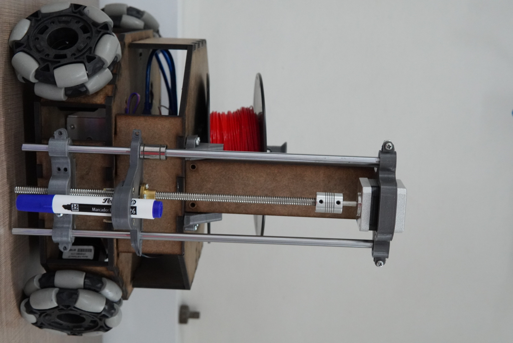

# Welcome to the 3drobot documentation.
In order to use the 3drobot you will need Ubuntu 20.04, Python 3 and ROS Noetic.


## Installation guide.
### Warning.
If you are installing in an embedded, be aware that the process may be different.

1. Update packages.
```console
$ sudo apt-get update
$ sudo apt-get upgrade
```
2. Install the required dependencies.
```console
$ sudo apt install python3-pip
$ sudo apt-get install git
$ sudo apt-get install ros-noetic-rosserial-arduino
$ sudo apt-get install ros-noetic-rosserial

$ /usr/bin/python3 -m pip install --upgrade pip
$ pip3 install numpy
$ pip3 install rospy
$ pip3 install pycnc
```

3. Clone and compile:
```console
$ git clone https://github.com/santiagorg2401/3drobot.git
$ cd 3drobot/
$ catkin_make
```

4. Test installation by running (warning! do not run this command from an embedded).
```console
$ roslaunch robot_gazebo display_g.launch
```

If Gazebo runs and the 3drobot spawns, then the installation was done succesfully.

### Note.
For ROS from source installations you will need to overlay this workspace on top of the one that you installed ROS.

## Trouble?
Start a new [discussion](https://github.com/santiagorg2401/3drobot/discussions) if you have any question related to the project, but, if you have a technical issue or a bug to report, then please create an [issue](https://github.com/santiagorg2401/3drobot/issues).

## Authors.
- [Óscar David Díaz Santos.](https://github.com/oscar2001ds)
- [Diana Sofía Villaraga Gañán.](https://github.com/Dianavillarraga)
- [Santiago Restrepo García.](https://github.com/santiagorg2401)
